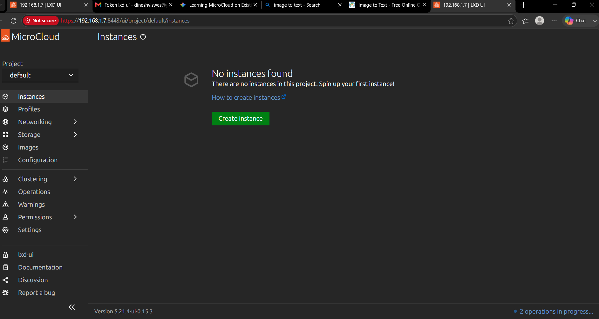
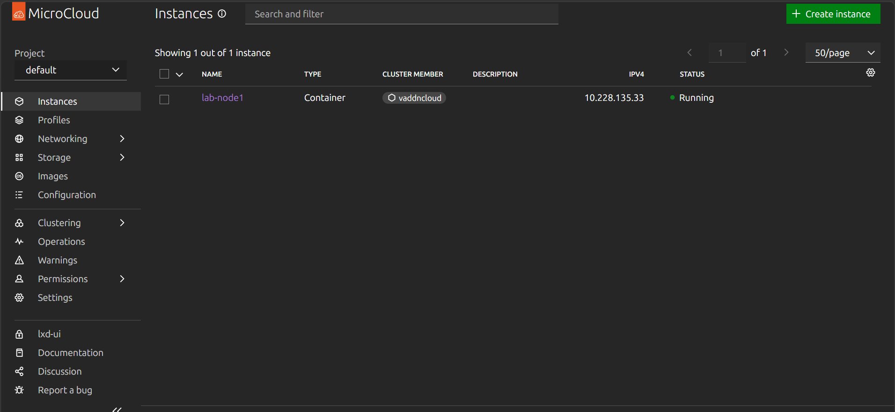
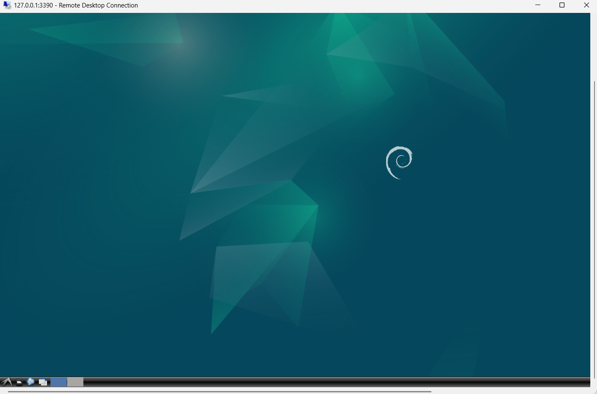
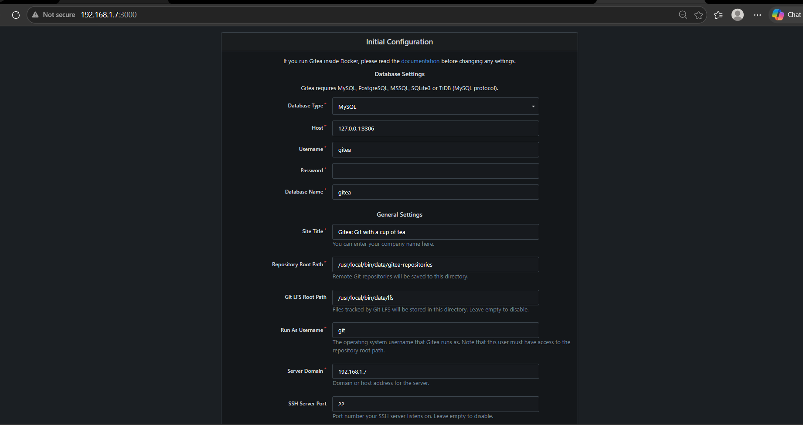
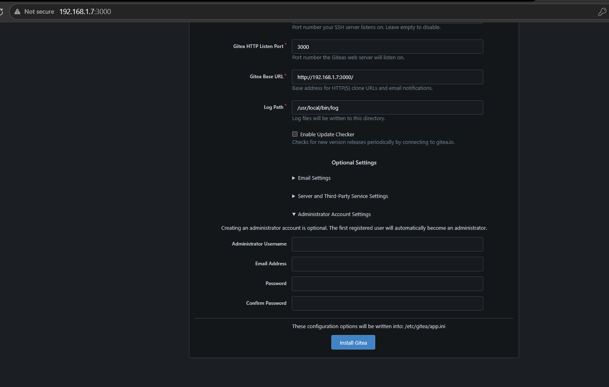
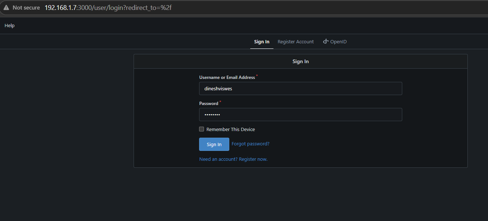
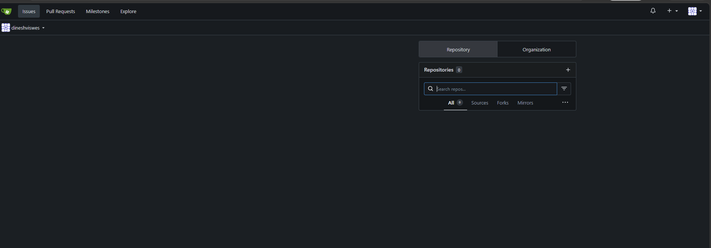

# Ubuntu MicroCloud Learning Lab

**Status:** Architecture Pivot Complete → Single-Node LXD Hypervisor + Gitea + Docker Registry + Portainer  
**Last Updated:** June 25, 2026  
**Hardware:** AMD FX-8350 Bare-Metal Server  
**Network:** `enp3s0` @ `192.168.1.7` / `192.168.1.8`  
**Orchestration:** LXD (Non-Clustered) + HTTPS Dashboard (`:8443`)

---

## Project Overview

This repository documents a home lab learning journey for **microservice distributed systems and Ubuntu MicroCloud VM creation** on Ubuntu. The project began with a MicroCloud multi-node cluster architecture but pivoted to a lean **single-node LXD hypervisor** after hardware failures and architectural analysis revealed MicroCloud is over-engineered for single-node learning workloads.

### Key Architectural Decisions

| Date | Decision | Rationale |
|------|----------|-----------|
| **Jun 12** | Purged `microcloud`, `microceph`, `microovn` snaps | Multi-node cluster software caused `dqlite` corruption, AppArmor loops, CPU overhead on single node |
| **Jun 12** | Migrated SSD from SATA III → SATA II (Port 4) | Legacy AMD SB950 chipset timing desync with NCQ caused `ata5.00` freezes |
| **Jun 16** | Injected missing `admins` RBAC group into LXD | LXD build lacked pre-configured admin group, blocking TLS trust token validation |
| **Jun 16** | Deployed `lab-node1` (Ubuntu 24.04) | Verified LXD engine provisioning mechanics end-to-end |
| **Jun 18** | Deployed `lab-desktop` (Debian 12 VM + LXDE) | Lightweight remote desktop for server management via RDP |
| **Jun 19** | Installed Gitea on `lab-node1` (native binary + SQLite) | Self-hosted Git service (analogous to Azure Repos / GitHub) for microservice source control |
| **Jun 22** | Static IP configured on `enp3s0` via Netplan | DHCP changed IP from `.7` to `.4`; locked `192.168.1.7` permanently with Netplan + `networkd` |
| **Jun 24** | Docker Registry planning on `lab-desktop` | VM networking issue (`enp5s0` ARP fails for external IPs, containers unaffected) — decided to use a new LXD container instead |
| **Jun 25** | Deployed `lab-registry` container + Docker Registry v2 (HTTPS) | Self-hosted container registry (ACR analogue) for microservice images — Docker inside LXD with nesting |
| **Jun 25** | Portainer CE + Registry UI installed | Docker GUI management and registry image browser |

---

## Timeline & Milestones

### June 12, 2026 — Hardware Stabilization & Architecture Pivot
- **Root Cause:** `ata5.00: exception Emask 0x10... frozen` kernel errors during `microcloud init`
- **Fix:** Physical SATA cable migration from Port 5 (SATA III) → Port 4 (SATA II)
- **Validation:** `smartctl` → `PASSED`, zero `Emask`/`frozen` errors in `journalctl -k`
- **Pivot:** Removed MicroCloud stack (`snap remove --purge microcloud microceph microovn`), reverted to raw LXD
- **Baseline:** Clean LXD state, network active at `192.168.1.8`, SSD healthy

### June 16, 2026 — LXD TLS Identity, RBAC & Dashboard Access
- **Network Debug:** Fixed dead Ethernet link/ARP failure between server and Airtel gateway
- **SSH Hardening:** Verified `ED25519` host key acceptance
- **LXD RBAC Fix:** Injected missing security schema:
  ```bash
  sudo lxc auth group create admins
  sudo lxc auth group permission add admins server admin
  lxc auth identity create tls/lxd-ui --group admins
  ```
- **UI Access:** Browser authenticated instantly at `https://192.168.1.7:8443` (dark mode)
- **Workload Test:** `sudo lxc launch ubuntu:24.04 lab-node1` → RUNNING, IP acquired, visible in dashboard

### June 18, 2026 — Lightweight Desktop VM (Debian 12 + LXDE)
- **VM Launch:** Deployed `lab-desktop` as LXD VM from `images:debian/12`
- **Desktop:** Installed LXDE + xrdp for remote desktop access
- **RAM Target:** ~350 MB idle — suitable for single-server environment
- **Remote Access:** SSH tunnel (`localhost:3390` → VM port 3389) verified working
- **Status:** VM RUNNING, RDP accessible via tunnel

### June 19, 2026 — Gitea Self-Hosted Git Service (Azure Repos / GitHub Analogue)
- **Container:** `lab-node1` (Ubuntu 24.04)
- **Installation:** Native Go binary (v1.22.3) + SQLite3 — no Docker overhead
- **Systemd Service:** Gitea runs as `git` user, auto-starts on boot
- **Database:** SQLite3 at `/var/lib/gitea/data/gitea.db`
- **UI:** Accessible at `http://192.168.1.7:3000`
- **Admin User:** `dineshviswes` (admin privileges confirmed via SQLite query)
- **LXD Proxy:** Port 3000 forwarded from container → host → LAN
- **Issues Faced & Resolved:**
  - ✅ Gitea binary's default `WorkPath` was `/usr/local/bin` (binary location) — fixed by adding `--work-path /var/lib/gitea` to systemd `ExecStart`
  - ✅ Web installer defaulted to MySQL (port 3306) since no SQLite config was present — fixed by pre-creating `app.ini` with `DB_TYPE = sqlite3` or selecting SQLite3 in the installer
  - ✅ LXD proxy device initially used `connect=tcp:127.0.0.1:3000` but containers have their own network namespace — fixed by pointing to container IP `10.228.135.33:3000`
  - ✅ Stale 0-byte `gitea.db` owned by `root` blocked the real database creation — cleaned up with `rm -f` and proper `chown git:git`

### June 25, 2026 — Docker Registry, Portainer & Registry UI (Azure Container Registry Analogue)
- **Container:** `lab-registry` (Ubuntu 24.04, LXD with `security.nesting=true`)
- **Docker:** Installed `docker.io` (v29.1.3) inside the container
- **Registry:** Docker Registry v2 with HTTPS (self-signed cert), persistent storage at `/var/lib/registry`
- **Registry UI:** `joxit/docker-registry-ui` at `http://192.168.1.7:8080` — browse images and tags
- **Portainer CE:** Docker management UI at `http://192.168.1.7:9000`
- **LXD Proxy Devices:**
  - `:5000` → `lab-registry:5000` (Docker Registry HTTPS)
  - `:9000` → `lab-registry:9000` (Portainer CE)
  - `:8080` → `lab-registry:8080` (Registry UI)
- **Issues Faced & Resolved:**
  - ✅ Docker push failed: "server gave HTTP response to HTTPS client" — fixed by generating a self-signed TLS cert for the registry
  - ✅ x509 "certificate relies on legacy Common Name field, use SANs instead" — regenerated cert with `-addext "subjectAltName=IP:192.168.1.7"`
  - ✅ x509 "certificate signed by unknown authority" — copied `registry.crt` to `/etc/docker/certs.d/192.168.1.7:5000/ca.crt`
  - ✅ Portainer Business Edition shown instead of CE (required setup token) — removed stale volume data and recreated with `portainer/portainer-ce:latest`
  - ✅ Registry UI CORS blocked by browser — added custom `config.yml` with `Access-Control-Allow-Origin` headers limiting to `http://192.168.1.7:8080`

---

## Current System State

```
┌─────────────────────────────────────────────────────────────┐
│                    AMD FX-8350 Server                       │
├─────────────────────────────────────────────────────────────┤
│  Hardware:     SSD @ SATA Port 4 (SATA II) — SMART: PASSED  │
│  Network:      enp3s0 → 192.168.1.7/8                       │
│  Hypervisor:   LXD 5.x (non-clustered, snap)                │
│  Dashboard:    https://192.168.1.7:8443 (TLS client cert)   │
│  Auth:         admins group + tls/lxd-ui identity ✓         │
│  Containers:   lab-node1 (ubuntu:24.04) — STOPPED           │
│                └─ Gitea v1.22.3 @ :3000                     │
│               lab-registry (ubuntu:24.04) — RUNNING         │
│                ├─ Docker Registry v2 @ :5000 (HTTPS)        │
│                ├─ Registry UI @ :8080                       │
│                └─ Portainer CE @ :9000                      │
│  VMs:          lab-desktop (debian:12 + LXDE) — STOPPED     │
│                ⚠ VM networking: enp5s0 ARP failure on       │
│                  external IPs, only gateway reachable        │
└─────────────────────────────────────────────────────────────┘
```

---

## Quick Reference: Operational Commands

### Gitea Service (Self-Hosted Git)

```bash
# Install Gitea (inside lab-node1 container)
sudo lxc exec lab-node1 bash
apt update && apt install -y git curl sqlite3
adduser --system --group --disabled-password --shell /bin/bash --home /home/git git
mkdir -p /var/lib/gitea/{custom,data,log}
chown -R git:git /var/lib/gitea && chmod -R 750 /var/lib/gitea
mkdir -p /etc/gitea && chown root:git /etc/gitea && chmod 770 /etc/gitea
wget -O /usr/local/bin/gitea https://dl.gitea.com/gitea/1.22.3/gitea-1.22.3-linux-amd64
chmod +x /usr/local/bin/gitea

# Systemd service
cat > /etc/systemd/system/gitea.service << 'EOF'
[Unit]
Description=Gitea (Git with a cup of tea)
After=network.target
[Service]
ExecStart=/usr/local/bin/gitea web --config /etc/gitea/app.ini --work-path /var/lib/gitea
Restart=always
User=git
Group=git
WorkingDirectory=/var/lib/gitea
Type=simple
[Install]
WantedBy=multi-user.target
EOF

systemctl daemon-reload && systemctl enable --now gitea

# Expose via LXD proxy (from host)
sudo lxc config device add lab-node1 gitea-port proxy listen=tcp:0.0.0.0:3000 connect=tcp:<container-ip>:3000

# Verify
sudo lxc exec lab-node1 -- sqlite3 /var/lib/gitea/data/gitea.db "SELECT id, name, email, is_admin FROM user;"

# Stop / Start / Restart
sudo lxc exec lab-node1 -- systemctl stop gitea
sudo lxc exec lab-node1 -- systemctl start gitea
sudo lxc exec lab-node1 -- systemctl restart gitea
sudo lxc exec lab-node1 -- systemctl status gitea
```

### Docker Registry (Self-Hosted Container Registry — ACR Analogue)

```bash
# Create registry container (from host)
sudo lxc launch ubuntu:24.04 lab-registry --config security.nesting=true --config security.syscalls.intercept.mknod=true

# Install Docker (inside lab-registry)
sudo lxc exec lab-registry bash
apt update && apt install -y docker.io
systemctl enable --now docker

# Generate self-signed cert with SAN
openssl req -x509 -newkey rsa:4096 -keyout /tmp/registry.key -out /tmp/registry.crt -days 365 -nodes -subj "/CN=192.168.1.7" -addext "subjectAltName=IP:192.168.1.7"

# Trust the cert locally
mkdir -p /etc/docker/certs.d/192.168.1.7:5000
cp /tmp/registry.crt /etc/docker/certs.d/192.168.1.7:5000/ca.crt

# Run registry with HTTPS + CORS for registry-ui
cat > /tmp/registry-config.yml << 'EOF'
version: 0.1
log:
  fields:
    service: registry
http:
  addr: :5000
  headers:
    Access-Control-Allow-Origin: ["http://192.168.1.7:8080"]
    Access-Control-Allow-Methods: ["GET", "POST", "PUT", "DELETE", "OPTIONS"]
    Access-Control-Allow-Headers: ["Authorization", "Content-Type", "Docker-Content-Digest"]
  tls:
    certificate: /certs/registry.crt
    key: /certs/registry.key
storage:
  filesystem:
    rootdirectory: /var/lib/registry
EOF

docker run -d \
  --name registry \
  --restart always \
  -p 5000:5000 \
  -v /var/lib/registry:/var/lib/registry \
  -v /tmp:/certs \
  -v /tmp/registry-config.yml:/etc/docker/registry/config.yml \
  registry:2

# Expose via LXD proxy (from host)
sudo lxc config device add lab-registry registry-port proxy listen=tcp:0.0.0.0:5000 connect=tcp:<container-ip>:5000

# Test registry API
curl -k https://192.168.1.7:5000/v2/
curl -k https://192.168.1.7:5000/v2/_catalog

# Push a test image
docker pull hello-world
docker tag hello-world 192.168.1.7:5000/hello-world
docker push 192.168.1.7:5000/hello-world

# Pull from registry
docker pull 192.168.1.7:5000/hello-world

# Registry logs
docker logs registry
```

### Registry UI (Image Browser)

```bash
# Run registry UI (inside lab-registry)
docker run -d \
  --name registry-ui \
  --restart always \
  -p 8080:80 \
  -e REGISTRY_URL=https://192.168.1.7:5000 \
  -e DELETE_IMAGES_DISABLED=true \
  -e SINGLE_REGISTRY=true \
  joxit/docker-registry-ui:latest

# Expose via LXD proxy (from host)
sudo lxc config device add lab-registry registry-ui-port proxy listen=tcp:0.0.0.0:8080 connect=tcp:<container-ip>:8080

# Browse → http://192.168.1.7:8080
```

### Portainer CE (Docker Management UI)

```bash
# Run Portainer (inside lab-registry)
docker run -d \
  --name portainer \
  --restart always \
  -p 9000:9000 \
  -v /var/run/docker.sock:/var/run/docker.sock \
  portainer/portainer-ce:latest

# Expose via LXD proxy (from host)
sudo lxc config device add lab-registry portainer-port proxy listen=tcp:0.0.0.0:9000 connect=tcp:<container-ip>:9000

# Access → http://192.168.1.7:9000 (create admin on first visit)
```

### Docker Management Commands (inside lab-registry)

```bash
# List images and containers
docker images
docker ps
docker ps -a

# Stop / Start registry container
docker stop registry
docker start registry

# View registry disk usage
docker system df
```

### LXD Administration
```bash
# Initialize LXD (first time only)
sudo lxd init

# RBAC: Create admin group & grant permissions
sudo lxc auth group create admins
sudo lxc auth group permission add admins server admin

# Generate trust token for browser UI
lxc auth identity create tls/lxd-ui --group admins
# → Copy the printed token into https://<ip>:8443
```

### Container Lifecycle
```bash
# Launch workload (container)
sudo lxc launch ubuntu:24.04 <name>

# Execute into container
sudo lxc exec <name> bash

# List all instances
sudo lxc list

# Stop all containers gracefully
sudo lxc stop --all
```

### VM Lifecycle
```bash
# Launch a VM (add --vm flag)
sudo lxc launch images:debian/12 --vm <name>

# Set CPU/memory limits
sudo lxc config set <name> limits.cpu 2
sudo lxc config set <name> limits.memory 2GiB

# Execute commands inside VM
sudo lxc exec <name> -- bash -c "apt update && apt install -y lxde"

# Get VM IP address
sudo lxc list | grep <name>

# Switch VM to bridged mode (LAN IP instead of NAT)
sudo lxc stop <name>
sudo lxc config device add <name> eth0 nic nictype=bridged parent=lxdbr0
sudo lxc start <name>
```

### Remote Desktop (SSH Tunnel)
```bash
# Tunnel RDP through SSH to a NAT'd VM
ssh -L 3390:<vm-ip>:3389 user@192.168.1.7

# Then connect Windows RDP (mstsc) to 127.0.0.1:3390
```

### Network Configuration (Static IP)
```bash
# Set static IP via Netplan (renderer: networkd)
sudo nano /etc/netplan/00-installer-config.yaml
#   addresses: [192.168.1.7/24]
#   routes:
#     - to: default
#       via: 192.168.1.1
#   nameservers:
#     addresses: [8.8.8.8, 1.1.1.1]
sudo netplan apply

# Verify static IP & default route
ip addr show enp3s0
# Expected: inet 192.168.1.7/24 ... valid_lft forever preferred_lft forever
ip route show default
# Expected: default via 192.168.1.1 dev enp3s0 proto static
```

### SSH Access & Troubleshooting
```bash
# Check SSH server status
sudo systemctl status ssh
sudo systemctl start ssh
sudo systemctl enable ssh

# Find your IP and username
hostname -I
whoami

# Check if password authentication is enabled
sudo grep PasswordAuthentication /etc/ssh/sshd_config

# Enable password auth if disabled
sudo sed -i 's/PasswordAuthentication no/PasswordAuthentication yes/' /etc/ssh/sshd_config
sudo systemctl restart ssh

# Debug connection issues (run from client)
ssh -v user@192.168.1.7

# Reset user password
passwd
```

### Network Diagnostics
```bash
# Check IP assignments
hostname -I
ip link show
ip addr show enp3s0

# Verify ARP/gateway reachability
arp -a
ping -c 3 192.168.1.1
```

### Graceful Lab Teardown (Runbook)
```bash
# 1. Stop Gitea service cleanly (flushes DB, closes connections)
sudo lxc exec lab-node1 -- systemctl stop gitea

# 2. Stop Docker containers inside lab-registry
sudo lxc exec lab-registry -- docker stop registry registry-ui portainer

# 3. Halt all LXD workloads
sudo lxc stop --all

# 4. Verify zero active instances
sudo lxc list

# 5. Power down physical host
sudo shutdown -h now
```

### Server Restart — Services Auto-Recovery
```bash
# 1. Power on server — LXD starts automatically on boot
# 2. Start lab-node1 container
sudo lxc start lab-node1

# 3. Gitea systemd service inside container auto-starts (enabled)
#    Check status:
sudo lxc exec lab-node1 -- systemctl status gitea

# 4. Start lab-registry container
sudo lxc start lab-registry

# 5. Docker + registry container inside lab-registry auto-starts (--restart always)
#    Check:
sudo lxc exec lab-registry -- docker ps

# 6. Optional: make containers auto-start on host boot
sudo lxc config set lab-node1 boot.autostart true
sudo lxc config set lab-registry boot.autostart true

# 7. Open browser:
#    - Gitea:     http://192.168.1.7:3000
#    - Registry:  https://192.168.1.7:5000/v2/
#    - Registry UI: http://192.168.1.7:8080
#    - Portainer: http://192.168.1.7:9000
```

> **Tip:** After setting `boot.autostart true` on both containers, the full stack (LXD → containers → all services) comes up automatically after a server power cycle. No manual steps needed.

---

## Learning Roadmap

### Phase 1: Foundation (COMPLETE ✓)
- [x] Hardware stabilization (SATA migration)
- [x] MicroCloud → LXD pivot
- [x] LXD TLS/RBAC configuration
- [x] Dashboard access verified
- [x] Base container deployment verified (lab-node1)
- [x] Desktop VM deployment verified (lab-desktop, Debian 12 + LXDE)

### Phase 2: Self-Hosted DevOps Platform (NEXT)
- [x] Gitea on `lab-node1` — self-hosted Git service (Azure Repos / GitHub analogue)
- [x] **Docker Registry** on `lab-registry` — self-hosted container registry (ACR analogue)
  - ✅ HTTPS with self-signed cert
  - ✅ Portainer CE for Docker management
  - ✅ Registry UI for browsing images
- [ ] Deploy microservice containers (API gateway, services, databases)
- [ ] Configure service discovery & load balancing
- [ ] Implement inter-service communication (gRPC/REST)

### Phase 3: Container Orchestration
- [ ] Set up lightweight Kubernetes (K3s / MicroK8s) — AKS analogue
- [ ] Deploy workloads to the cluster
- [ ] Configure ingress, scaling, monitoring

### Phase 4: Distributed Systems Patterns
- [ ] Design distributed transactions & eventual consistency
- [ ] Implement circuit breakers, retries, timeouts
- [ ] Test failure scenarios & resilience patterns

### Phase 5: Observability & Resilience
- [ ] Add Prometheus/Grafana stack
- [ ] Configure structured logging
- [ ] Chaos testing (container kill, network partition)

---

## Reference Documents

| File | Description |
|------|-------------|
| `Consolidated_Engineering_Log_2026-06-12.md` | End-of-day summary: hardware fix, snap purge, LXD pivot |
| `Full_Day_Analysis_2026-06-12.md` | Detailed RCA: `ata5.00` freezes, dqlite corruption, AppArmor loops |
| `Simplifying your distributed cloud infrastructure with MicroCloud.md` | Canonical whitepaper (Q4 2024) — MicroCloud architecture & deployment guide |
| `README.md` (this file) | Living document — lab state, commands, roadmap, screenshots |

---

## Screenshots

### LXD Dashboard

| Initial State | lab-node1 Running |
|:---:|:---:|
|  |  |

### Debian 12 VM Desktop


### Gitea on lab-node1 (`http://192.168.1.7:3000`)

| Install Page | Install Config | Sign-In | Dashboard |
|:---:|:---:|:---:|:---:|
|  |  |  |  |

---

## Why Not MicroCloud?

> **MicroCloud is designed for multi-node HA clusters** (3+ nodes for Ceph quorum).  
> Our single-node lab gained only: `dqlite` corruption, AppArmor denial loops, CPU overhead from orchestration daemons.  
> **Raw LXD** gives direct control over containers, storage, and networking — ideal for learning microservice distributed systems and VM creation without distributed systems complexity.

> *From the whitepaper: "MicroCloud supports single-member deployments which are great for testing... For HA, and the ability to recover a cluster should something go wrong, you need a minimum of three members."*

---

## License & Attribution

- **Project Docs:** Personal learning lab — no license
- **MicroCloud Whitepaper:** © 2024 Canonical Limited (included for reference)
- **Ubuntu/LXD:** Canonical trademarks

---

*Generated from engineering logs — keep this README updated as the lab evolves.*